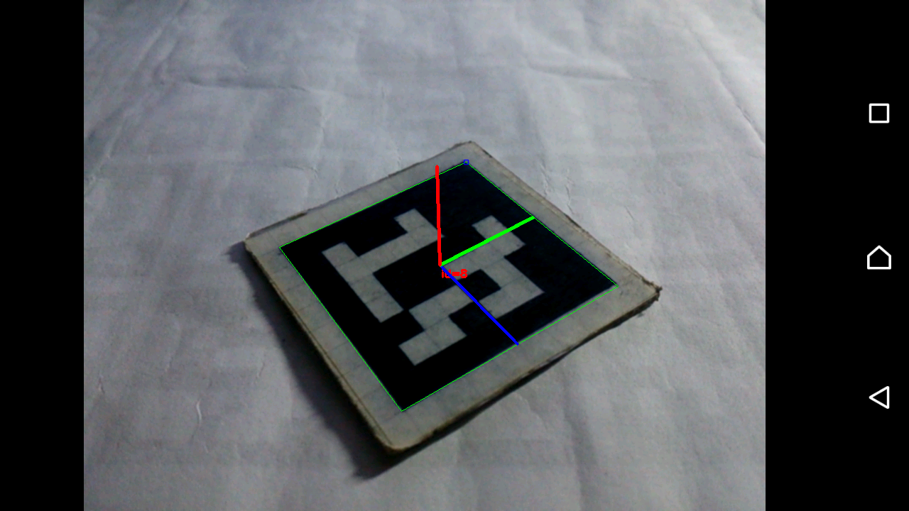
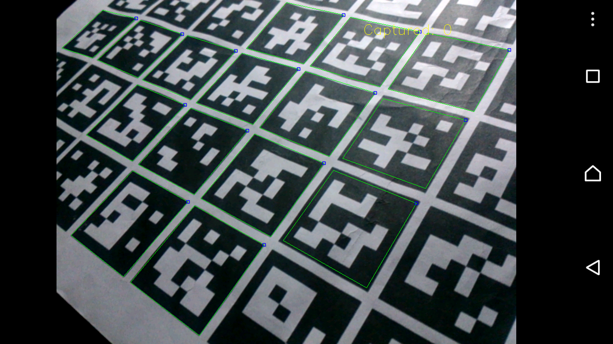
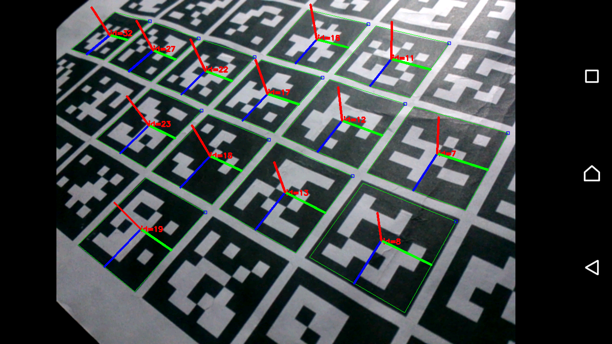
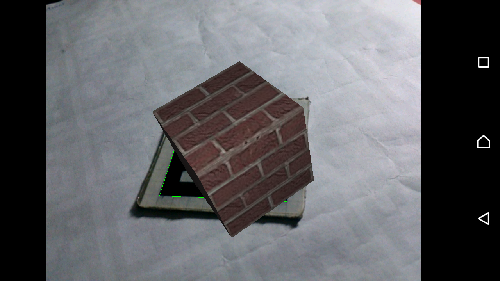

# Aruco Android

> It is an application to detect Aruco Markers.

<center>
	
</center>

## Credits

This application uses:

- **opencv-contrib** for computer vision, see [LICENSE](opencv344-contrib/LICENSE),
- **aruco**, module from opencv-contrib, for ***aruco markers*** detection.
- **rajawali**, for 3D models renderer.

See more about ***opencv***, and ***aruco*** from:
 
- [opencv](https://opencv.org)
- [opencv-contrib](https://github.com/opencv/opencv_contrib)
- [aruco](http://www.uco.es/investiga/grupos/ava/node/26)
- [rajawali](https://github.com/Rajawali/Rajawali)

## License

As stated above, **opencv-contrib** uses the BSD license. For details, see [LICENSE](opencv344-contrib/LICENSE).

## About

Aruco Android is an application to detect ***Aruco Markers***, and try to render a 3D model above it.

## Setting

If you have `No Implementation Found` or `library "libopencv_java3.so" not found`, instead of `master`, use `feature/all-platforms`

```
git fetch origin
git checkout feature/all-platforms
git pull origin feature/all-platforms
```

Alternative method: copy all the native opencv libraries into the project, for this:

- download these [libraries](https://github.com/RivoLink/opencv-android/tree/master/opencv3_4_4_contrib/native/libs)
- then, paste all in this [directory](https://github.com/RivoLink/Aruco-Android/tree/master/opencv344-contrib/src/main/jniLibs) of your project

## Using

Camera must be calibrated before detect markers, for that, 

- compile and run ***camera-calibration*** projet, 
- present the ***calibration board*** to the camera
- capture between ***15 and 20 images***, and 
- click on ***calibrate*** menu.

Each frame must contain at least ***10 markers***

<center>
	
</center>

After that, compile ***app*** project and enjoy... 

<center>
	
</center>

## Contributions

You can help turn this application into Augmented Reality, there are some bugs on the positioning of the 3D model above marker. 

<center>
	
</center>

Thank you :)

## Similar application

You can see in the repository below another marker detection application which uses [Vuforia](https://library.vuforia.com/) library.

[https://github.com/RivoLink/Vuforia-Android](https://github.com/RivoLink/Vuforia-Android)


